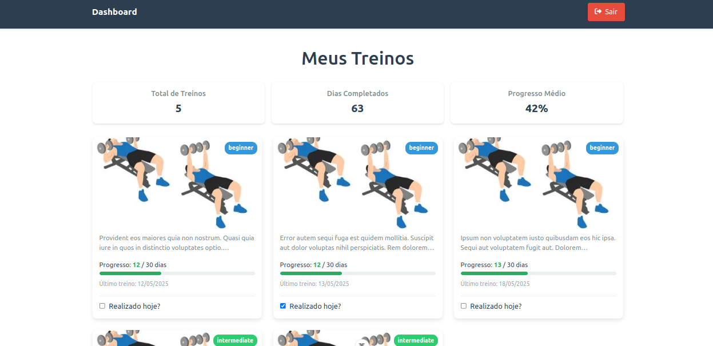

# README - Sistema de Gerenciamento de Treinos e Nutrição (Desafio Always Fit)



## 📌 Visão Geral do Projeto

1. **Backend API**: Desenvolvido em Laravel
2. **Frontend App**: Desenvolvido em Vue.js

### Pré-requisitos

- PHP 8.0+
- Composer
- Node.js 14+
- npm ou yarn
- MySQL 5.7+
- Git

### ⚙️ Configuração do Ambiente

1. **Clone o repositório**:
   ```bash
   git clone [URL_DO_REPOSITORIO]
   ```

2. **Configure o backend (API)**:
   ```bash
   cd api
   cp .env.example .env
   ```

   Edite o `.env` com suas configurações de banco de dados:
   ```
   DB_CONNECTION=mysql
   DB_HOST=127.0.0.1
   DB_PORT=3306
   DB_DATABASE=nome_do_banco
   DB_USERNAME=usuario
   DB_PASSWORD=senha
   ```

3. **Configure o frontend (App)**:
   ```bash
   cd ../app
   cp .env.example .env
   ```

   Edite o `.env` com a URL da API:
   ```
   VITE_API_URL=http://localhost:8000
   ```

## 🛠 Instalação e Execução

### Backend (API Laravel)

1. Instale as dependências:
   ```bash
   cd api
   composer install
   ```

2. Gere a chave da aplicação:
   ```bash
   php artisan key:generate
   ```

3. Execute as migrações e seeders:
   ```bash
   php artisan migrate
   ```

   Para executar apenas o seeder de planos nutricionais:
   ```bash
   php artisan db:seed --class=NutritionPlanSeeder
   ```

4. Inicie o servidor:
   ```bash
   php artisan serve
   ```
   A API estará disponível em: `http://localhost:8000`

### Frontend (App Vue.js)

1. Instale as dependências:
   ```bash
   cd app
   npm install
   ```

2. Inicie o servidor de desenvolvimento:
   ```bash
   npm run dev
   ```
   O app estará disponível em: `http://localhost:3000`

## 🌐 Endpoints da API

Principais rotas disponíveis:

```
GET    /api/treinos        - Lista todos os treinos
GET    /api/progresso      - Mostra progresso
GET    /api/planos         - Lista planos nutricionais
POST   /api/register       - Registro de usuário
POST   /api/login          - Login
POST   /api/logout         - Logout (autenticado)
```

## 🧩 Estrutura do Projeto

```
.
├── api/                   # Backend Laravel
│   ├── app/               # Lógica da aplicação
│   ├── database/          # Migrations e Seeders
│   │   ├── migrations/
│   │   └── seeders/
│   └── routes/            # Definição de rotas
│
└── app/                   # Frontend Vue.js
    ├── public/            # Assets públicos
    ├── src/               # Código fonte
    │   ├── assets/        # Imagens, estilos
    │   ├── components/    # Componentes Vue
    │   ├── stores/        # Pinia stores
    │   └── views/         # Páginas
    └── vite.config.js     # Config Vite
```

## 🔍 Detalhes Técnicos

### Backend
- Laravel 10
- Sanctum para autenticação
- Migrations para estrutura do banco
- Seeders para dados iniciais
- API RESTful

### Frontend
- Vue.js 3
- Composition API
- Pinia para gerenciamento de estado
- Axios para requisições HTTP
- Vue Router para navegação
- Componentes reutilizáveis

## 🐛 Solução de Problemas

1. **Erros de migração**:
   - Verifique as credenciais do banco no `.env`
   - Execute: `php artisan migrate:fresh`

2. **Problemas de autenticação**:
   - Limpe o cache: `php artisan cache:clear`
   - Verifique o token Sanctum

3. **Erros no frontend**:
   - Delete `node_modules` e reinstale: `rm -rf node_modules && npm install`
   - Verifique a URL da API no `.env`

## 📄 Licença

Este projeto está licenciado sob a licença MIT - veja o arquivo [LICENSE](LICENSE) para detalhes.